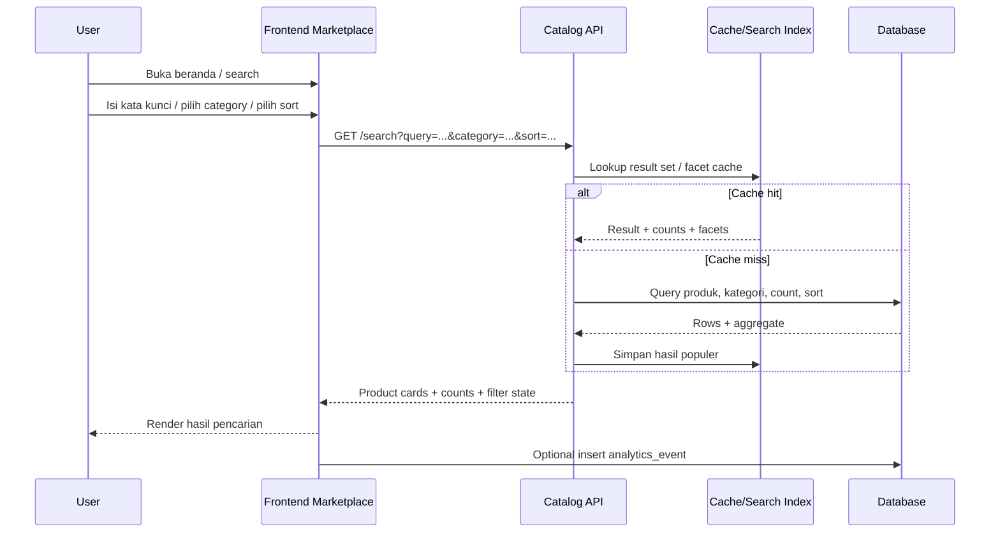
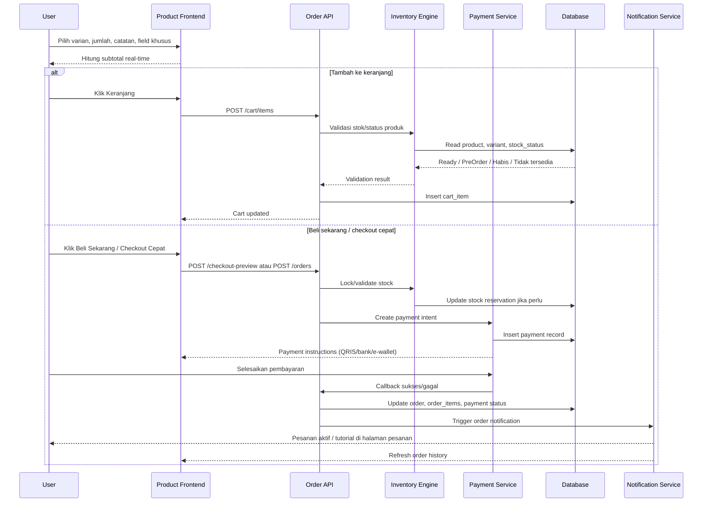
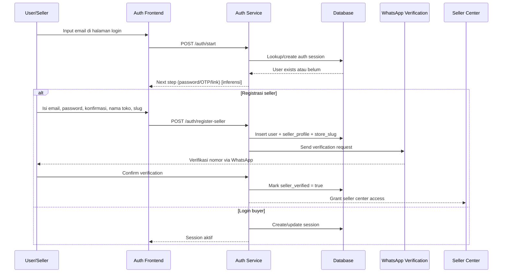
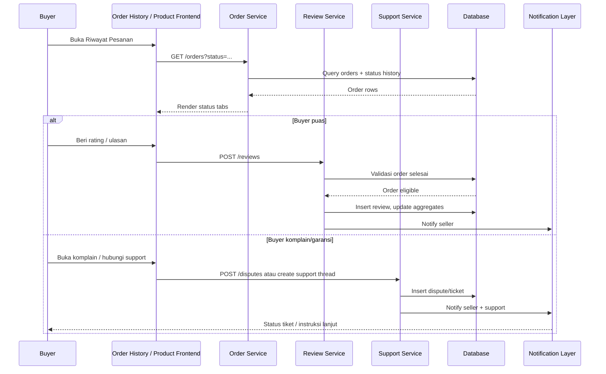
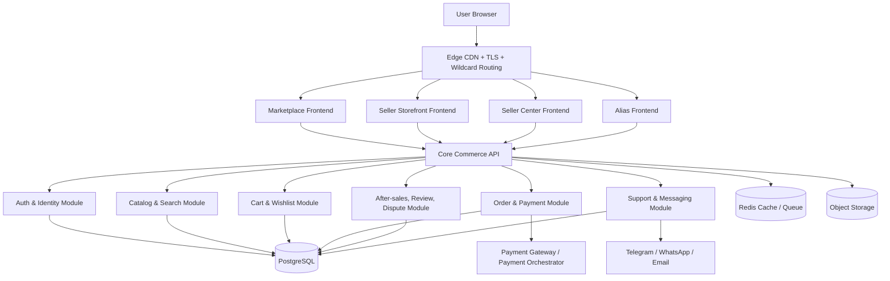

# Analisa Fullstack Pembuatan Web `marketku.id`

## Ringkasan eksekutif

Dari permukaan publik yang berhasil diobservasi pada domain `marketku.id` dan subdomain-subdomainnya, `Marketku` tampak dibangun sebagai marketplace produk digital dengan tiga lapisan pengalaman yang dibedakan cukup jelas: marketplace publik di domain utama, storefront seller berbasis subdomain seperti `montshop.marketku.id`, dan area operasional seller terpisah di `dashboard.marketku.id`. Di atas itu masih ada `go.marketku.id`, yang terlihat sebagai surface alias atau alternatif rute publik, walau detail fungsionalnya tidak terbuka kaya seperti domain utama. Bukti paling kuat untuk arsitektur ini adalah keberadaan route publik marketplace seperti beranda, pencarian, kategori, flash sale, detail produk, cart, wishlist, riwayat pesanan, halaman bantuan, kontak, syarat, dan privasi; ditambah login Seller Center pada subdomain dashboard dan instruksi bahwa checkout seller-specific dipakai agar stok tetap sinkron. citeturn13search5turn28search1turn21search2turn27search11turn13search10turn42search0

Secara fungsional, situs ini sudah memuat blok-blok e-commerce digital yang penting: discovery melalui kategori, pencarian, sort, flash sale, dan best seller; detail produk dengan varian, jumlah, catatan ke seller, wishlist, cart, buy now, share, seller stats, ulasan, dan produk serupa; serta after-sales dengan riwayat pesanan yang memiliki status `Proses`, `Berhasil`, `Tidak Berhasil`, `Garansi Aktif`, dan `Dikomplain`. Produk juga memperlihatkan tipe fulfillment yang berbeda seperti `Akun Digital`, `Link Akses`, `OTP Service`, `Pre-Order`, dan `Produk digital legal`, yang berarti backend kemungkinan sudah memodelkan beberapa jalur pemenuhan order yang berbeda. citeturn19search5turn28search0turn53search1turn53search3turn59search0turn63search0turn63search1turn63search2turn64search1turn27search16

Dari sisi UX, kekuatan utama `Marketku` adalah orientasi tugas yang sangat jelas: mencari produk, masuk/daftar, checkout, lacak pesanan, kontak support, dan masuk Seller Center. Ada sinyal positif seperti `Mode Gelap`, label bahasa `Bahasa: ID`, empty state yang cukup informatif pada cart, kategori kosong, dan riwayat pesanan kosong, serta penggunaan seller metrics seperti respons dan rating untuk membangun trust. Namun, ada juga beberapa sinyal friksi yang kuat: inkonsistensi penamaan (`Pesanan`, `Riwayat Pesan`, `Riwayat Pesanan`), inkonsistensi trust label (`Trade Guard` versus `Marketku`), perbedaan data antara root marketplace dan storefront seller, serta teks DOM/snippet yang tampak “menempel” seperti `MasukDaftar`, `SSemua88`, `00 ulasan1produk`, atau daftar metode pembayaran yang menyatu tanpa separator. Semua ini penting karena tidak hanya memengaruhi UI, melainkan juga SEO, aksesibilitas, dan keterbacaan crawler. citeturn27search19turn32search6turn32search11turn7search3turn11search0turn65search0turn33search3turn33search7turn18search0turn20search8turn61search0turn61search1

Kesimpulan tekniknya: implementasi yang paling masuk akal untuk scope publik yang terlihat adalah arsitektur modular monolith commerce dengan wildcard subdomain untuk storefront seller, frontend SSR/SPA hybrid untuk marketplace publik dan dashboard seller, auth terpusat, order/payment engine terpusat, dan persistence relasional dengan cache untuk search-discovery. Prioritas tertinggi bukan sekadar menambah fitur baru, tetapi merapikan konsistensi data, struktur DOM/SEO, trust copy, dokumentasi operasional publik, dan hardening security/performance/testing di sekitar flow yang sudah ada. citeturn62search1turn42search0turn24search0turn13search10turn27search2turn43search2

## Metodologi dan batas observasi

Penelitian ini dibatasi hanya pada permukaan publik yang tampil di domain `marketku.id` dan subdomain terkait yang masih berada dalam payung domain yang sama, termasuk storefront seller seperti `montshop.marketku.id`, area seller di `dashboard.marketku.id`, dan alias `go.marketku.id`. Permukaan yang teridentifikasi secara publik mencakup beranda, search, categories, flash sale, detail produk, reviews, cart, wishlist, riwayat pesanan, login, register seller, help, contact, terms, privacy, Seller Center, dan beberapa route varian pada seller storefront. citeturn13search5turn19search5turn18search0turn28search0turn13search8turn32search6turn21search2turn27search11turn25search2turn13search7turn24search0turn46search0turn13search0turn9search0turn13search10turn37search0

Karena sumber yang boleh dipakai hanya domain ini, maka analisis dibedakan menjadi dua lapis. Lapis pertama adalah **yang benar-benar terlihat** dari route publik, copy, dan snippet halaman. Lapis kedua adalah **inferensi teknis** yang diturunkan dari pola route, navigasi, perbedaan subdomain, jenis status order, tipe fulfillment produk, dan panduan help/contact/legal. Di bagian yang inferensial, saya akan menyatakannya secara eksplisit sebagai kemungkinan implementasi yang paling cocok dengan bukti publik yang ada. citeturn42search0turn59search0turn63search0turn63search1turn63search2turn64search1

Hal penting yang perlu dicatat adalah bahwa permukaan publik memperlihatkan beberapa snapshot yang tampak tidak selalu konsisten antar-domain atau antar-parameter, misalnya root search yang pernah tersnippet sebagai `0 produk ditemukan`, sementara `search?sort=newest` menampilkan `52 produk ditemukan`, dan categories pada storefront seller menampilkan `25 kategori` serta `88 produk`, sedangkan root categories pernah tampak `0 kategori` dan `0 produk`. Karena itu, saya menafsirkan hasil ini sebagai **observasi publik yang valid**, tetapi tidak selalu sebagai cerminan data real-time yang sepenuhnya sinkron. citeturn19search2turn19search0turn18search0turn18search1turn56search0

## Inventaris halaman dan evaluasi UI/UX

### Inventaris halaman dan fitur publik

| Halaman atau pola route | Fungsi fungsional yang terlihat | Catatan penting | Bukti |
|---|---|---|---|
| `/` di domain utama | Hero marketplace, CTA jelajah kategori, `Lihat semua`, blok marketplace seperti `Semua Produk`, `Flash Sale`, `Best Seller`, `Kategori`, link seller docs, bantuan, dan footer pembayaran | Copy pemasaran menekankan pengiriman/aktivasi instan, SSL, promo, support 24/7 | citeturn28search1turn48search0turn27search4 |
| `/search`, `/search?sort=newest`, `/search?category=*` | Pencarian produk, filter, sorting (`Paling Relevan`, `Terbaru`, `Termurah`, `Rating tinggi`), chip kategori, result count | Query params publik yang terlihat: `sort`, `category` | citeturn19search0turn19search2turn19search5turn19search6turn14search3turn14search5 |
| `/categories` | Daftar kategori dan jumlah produk | Pada storefront seller terlihat `25 kategori` dan `88 produk`; pada root pernah tampil empty state `0 kategori` dan `0 produk` | citeturn18search0turn18search1turn56search0 |
| `/flash-sale` | Daftar promo aktif, countdown, harga coret dan harga diskon | Pada storefront seller terlihat `2 promo` dan timer berakhir | citeturn28search0 |
| `/{kategori}/product/{slug-uuid}` | Detail produk, breadcrumbs, seller card, tabs `Deskripsi`, `Spesifikasi`, `Diskusi` atau `Info seller`, rating, terjual, harga | Variasi route juga terlihat di root marketplace | citeturn24search2turn24search3turn24search4turn34search3turn31search6 |
| `/product/{uuid}` pada seller subdomain tertentu | Detail produk versi seller storefront | Menunjukkan ada pola route alternatif tanpa segment kategori | citeturn10search12turn32search10 |
| Detail produk modern | Pemilihan varian, quantity stepper, catatan untuk seller, subtotal, `Beli Sekarang`, `Keranjang`, `Checkout Cepat`, `Wishlist`, `Share` | Sebagian produk juga membutuhkan input field khusus seperti username Twitter | citeturn52search4turn52search7turn53search0turn53search1turn53search3turn53search7 |
| Status produk dan fulfillment | `Ready`, `Pre Order`, `Habis`, `Tidak tersedia`, tipe `Akun Digital`, `Link Akses`, `OTP Service`, `Produk digital legal` | Ini mengindikasikan engine order harus mendukung beberapa jenis fulfillment | citeturn52search0turn52search6turn52search17turn52search22turn63search0turn63search1turn63search2turn64search1 |
| Ulasan | Ringkasan ulasan, `Lihat Semua`, review gated setelah transaksi selesai, route `/reviews` | Produk tanpa review memunculkan empty state | citeturn23search0turn23search2turn23search4turn13search8 |
| `/cart` | Keranjang belanja | Empty state: `Keranjang belanjamu kosong` + CTA `Mulai Belanja` | citeturn32search6 |
| `/riwayat-pesanan` | Daftar order, filter status, empty state, CTA `Jelajahi produk` | Status yang terlihat: `Semua`, `Proses`, `Berhasil`, `Tidak Berhasil`, `Garansi Aktif`, `Dikomplain` | citeturn7search3turn27search11turn59search0 |
| `/wishlist` | Route wishlist tersedia | Fungsinya juga terlihat dari CTA `Wishlist` pada detail produk | citeturn21search2turn37search3turn53search3 |
| `/login` | Login publik berbasis email-first | Step yang terlihat baru input email dan tombol `Lanjutkan` | citeturn25search2turn13search4 |
| `/register?role=seller` | Registrasi seller dengan password dan konfirmasi password | Seller diminta membuat toko dan slug; setelah daftar ada verifikasi nomor via WhatsApp | citeturn13search7turn25search1turn62search1 |
| Halaman register yang sama | Jalur customer dan seller disebutkan | Ini menunjukkan model pendaftaran multi-role pada auth flow publik | citeturn0search5 |
| `/help` | Help center publik terpusat | Menjelaskan login publik terpusat, seller checkout untuk sinkron stok, onboarding toko, wallet, after-sales, dan dukungan buyer/seller | citeturn24search0turn41search0turn42search0turn47search0turn65search0turn66search0 |
| `/contact` | Support contact | Telegram disebut jalur tercepat untuk buyer; seller diarahkan mulai dari Seller Center; support meminta invoice/email/username Telegram/screenshot | citeturn46search0turn13search2turn45search1 |
| `/terms` | Syarat operasional marketplace | Data akun harus akurat; pembayaran bisa melibatkan escrow/verifikasi tambahan; listing bisa dihapus atau dibekukan bila menimbulkan sengketa atau melanggar policy | citeturn13search0turn27search2turn43search0turn44search0turn31search5 |
| `/privacy` | Ringkasan privasi | Data sensitif untuk auth/fraud/sengketa/kepatuhan; ada penggunaan untuk audit internal/analitik operasional; ada bagian retensi dan keamanan | citeturn9search0turn12search2turn43search2turn44search1 |
| `dashboard.marketku.id/` | Seller Center login terpisah | Email-first, akses seller-specific, opsi Telegram/WhatsApp terlihat di halaman login | citeturn13search10turn65search1 |
| `go.marketku.id/`, `/register`, `/wishlist` | Alias atau surface publik tambahan | Judul halaman ada, namun detail snippet tidak sekaya domain utama | citeturn37search0turn37search1turn37search3 |
| Error/empty state | Produk tidak ditemukan, kategori kosong, cart kosong, order kosong | Ada CTA kembali atau mulai belanja/jelajah produk | citeturn32search10turn32search11turn32search6turn7search3 |

### Analisis UI/UX per kelompok halaman

| Kelompok halaman | Analisis UI/UX | Accessibility dan responsivitas | Rekomendasi |
|---|---|---|---|
| Beranda dan discovery | Beranda menonjolkan value prop yang sangat task-oriented: jelajah kategori, marketplace blocks, promo, seller links, dan metode pembayaran. Ini bagus untuk orientasi awal. Keberadaan `Flash Sale`, `Best Seller`, dan `Kategori` menunjukkan informasi dipilah ke mental model e-commerce yang familiar. Namun saat teks situs dibaca crawler, beberapa elemen tampak terlalu rapat dan menyatu, misalnya label navigasi dan footer pembayaran. citeturn28search1turn48search0turn27search4turn20search8turn61search0 | Ada sinyal positif berupa `Mode Gelap` dan `Bahasa: ID`, yang biasanya mengindikasikan perhatian pada preferensi visual dan locale. Akan tetapi, dari sumber publik ini saya tidak bisa memverifikasi focus state, keyboard navigation, heading hierarchy, atau alt text. citeturn11search0turn27search19 | Rapikan separator visual dan DOM antar-item menu/footer; gunakan spacing, list semantics, dan label yang lebih bersih supaya terbaca rapi oleh screen reader dan search snippet. |
| Search, kategori, dan flash sale | Search page tampak kaya fungsi: chip kategori, sorting, result count, dan kemungkinan kartu produk. Flash sale punya countdown dan harga sebelum/sesudah diskon, yang baik untuk urgency. Problem terbesarnya adalah konsistensi data publik: root search pernah tampil `0 produk`, tetapi `sort=newest` menampilkan `52 produk`; root categories pernah `0 kategori`, sementara storefront seller menampilkan `25 kategori` dan `88 produk`. Ini menciptakan persepsi data yang tidak stabil. citeturn19search2turn19search0turn18search1turn18search0turn56search0turn28search0 | Responsivitas tidak dapat diverifikasi langsung, tetapi penggunaan chip kategori, label sort singkat, dan utility `Lacak Pesanan` memberi sinyal pola UI yang condong ramah mobile. citeturn19search5turn27search19 | Satukan source of truth antara root marketplace dan seller storefront, lalu tambahkan canonicalization/caching strategy yang membuat angka count, kategori, dan produk tidak saling bertentangan di permukaan publik. |
| Detail produk dan review | Ini adalah halaman paling lengkap: seller identity, metrik respons, rating, tabs, varian, quantity stepper, catatan seller, subtotal, CTA pembelian, wishlist, share, produk serupa, dan ulasan. Dari sisi conversion, ini kuat. Dari sisi UX, problemnya adalah kepadatan CTA: `Chat Seller`, `Beli Sekarang`, `Keranjang`, `Checkout Cepat`, `Wishlist`, dan `Share` tampak sama-sama primer pada snippets publik. Beberapa halaman juga menampilkan trust text berbeda: kadang `Checkout aman dijaga oleh Trade Guard`, kadang `Checkout aman dijaga oleh Marketku`. citeturn53search1turn53search3turn54search0turn54search12turn33search3turn33search7 | Label field yang terlihat sudah cukup eksplisit pada beberapa produk, misalnya `Masukkan nama pengguna Twitter Anda`, `Catatan untuk seller`, `Jumlah`, dan pilihan varian. Itu sinyal baik untuk clarity form. Tetapi kembali, validasi error state, focus management, dan hubungan label-input tidak bisa diverifikasi dari permukaan publik ini. citeturn53search0turn52search4turn52search7 | Ubah hierarki CTA menjadi satu CTA primer (`Beli Sekarang`) dan CTA sekunder yang lebih ringan; samakan trust label; tampilkan status stok dan tipe fulfillment secara konsisten sebagai badge terstruktur. |
| Cart, wishlist, riwayat pesanan, empty/error state | Empty state pada cart, kategori kosong, produk tidak ditemukan, dan riwayat pesanan kosong cukup baik karena memberi arahan tindakan selanjutnya. Order history juga memperlihatkan model after-sales yang matang dengan status `Garansi Aktif` dan `Dikomplain`. Namun penamaan area order tidak konsisten: ada `Pesanan`, `Riwayat Pesan`, dan `Riwayat Pesanan`, yang berpotensi membingungkan. citeturn32search6turn32search11turn32search10turn59search0turn7search0turn21search10turn27search11 | Empty state adalah elemen UX yang biasanya sangat membantu pengguna mobile dan baru. Dari sisi a11y, empty state ini sudah memberi petunjuk tindakan yang jelas, tetapi saya tidak bisa memverifikasi kontras, ikon dekoratif, atau pembacaan screen reader. citeturn32search6turn7search3 | Standarkan nomenklatur area order menjadi satu istilah konsisten, misalnya selalu `Pesanan` atau selalu `Riwayat Pesanan`; tampilkan penjelasan singkat per status setelah-sales. |
| Auth publik dan onboarding seller | Login email-first meminimalkan friksi langkah awal. Register seller juga sangat jelas secara value: toko + slug seller dibuat sejak awal, alur seller dipisah dari buyer, dan akses seller bergantung verifikasi WhatsApp. Ini desain onboarding yang tegas dan sesuai model multi-tenant. Di sisi lain, halaman login publik yang tampak hanya memperlihatkan step email; mekanisme langkah lanjutannya tidak dapat dipastikan dari halaman publik. citeturn25search2turn13search7turn25search1turn62search1turn41search0 | Form labels seperti `Alamat email`, `Password`, dan `Konfirmasi Password` sudah eksplisit. Itu baik. Tetapi belum bisa diverifikasi apakah ada feedback inline untuk invalid input, rate-limiting UI, atau langkah pemulihan akun yang memadai. citeturn25search1turn25search2 | Pertahankan email-first, tetapi perjelas langkah berikutnya di UI setelah `Lanjutkan`, misalnya password, OTP, atau magic link; tampilkan state verification seller secara transparan. |
| Help, contact, legal | Secara information architecture, keputusan memusatkan help publik di domain utama itu bagus, karena buyer, seller, dan support memakai jalur yang sama. Contact page juga operasional: support minta invoice, email akun, username Telegram, kronologi, dan screenshot. Terms/privacy cukup operasional, bukan formalitas kosong: ada data akurat, escrow/verifikasi tambahan, moderasi listing, data sensitif, audit internal, analitik operasional, dan retensi. Ini kuat secara UX kepercayaan. citeturn24search0turn47search0turn46search0turn13search2turn27search2turn43search2turn44search1 | Bantuan yang baik sering kali lebih penting daripada UI cantik di marketplace digital. Dari a11y, halaman teks seperti help/legal biasanya relatif mudah dioptimalkan, tetapi struktur heading, anchor links, dan semantic sections tidak terlihat dari snippet publik ini. | Tambahkan FAQ yang lebih terstruktur per role, publish `Panduan Seller` dan `Biaya Layanan` sebagai halaman yang mudah ditemukan dan terindeks, serta samakan bahasa antara help dan produk. |

Ada tiga temuan UX lintas-halaman yang paling load-bearing. Pertama, **pola multi-subdomain sudah benar secara bisnis**, tetapi root marketplace dan storefront seller belum tampak sepenuhnya konsisten di permukaan publik. Kedua, **struktur teks untuk crawler tampak belum rapi**, terlihat dari token menyatu seperti `MasukDaftar`, `SSemua88`, `00 ulasan1produk`, dan daftar metode pembayaran yang tidak dipisah dengan baik. Ketiga, **trust copy dan istilah operasional belum sepenuhnya seragam**, misalnya `Trade Guard` versus `Marketku`, dan `Pesanan` versus `Riwayat Pesan`. Ketiganya sebaiknya diprioritaskan karena berdampak langsung ke conversion, SEO, dan persepsi kualitas produk. citeturn42search0turn19search0turn18search0turn20search8turn61search0turn61search1turn33search3turn33search7turn27search11

## Alur data end-to-end

### Discovery, pencarian, dan filter

Flow discovery yang tampak paling jelas dimulai dari beranda atau search page, lalu berlanjut ke query params publik seperti `category` dan `sort`. Search page memperlihatkan counts, sort options, dan kategori filter; categories page memperlihatkan jumlah kategori serta produk; flash sale memberi lane discovery tambahan untuk promo. Dari bukti publik, flow ini kemungkinan besar adalah read-heavy dan idealnya tidak mengubah data transaksi inti, kecuali logging analytics pencarian/klik. citeturn19search0turn19search2turn19search5turn18search0turn28search0



Secara data, perubahan database yang **mungkin** terjadi pada flow ini hanyalah event non-kritis seperti `search_analytics`, `view_catalog_page`, atau `click_product_card`. Tidak ada bukti publik bahwa browsing mengubah order/cart secara otomatis. Karena page count publik antara root dan storefront pernah berbeda, caching layer harus memisahkan scope `marketplace-global` versus `storefront-seller` agar count tidak tercampur. Ini inferensi, tetapi inferensi yang sangat kuat dari perbedaan hasil publik yang terlihat. citeturn19search0turn19search2turn18search0turn18search1turn56search0

### Detail produk, cart, dan checkout

Halaman detail produk memperlihatkan hampir seluruh state yang diperlukan untuk flow order digital: varian, quantity stepper, catatan ke seller, subtotal, CTA `Beli Sekarang`, `Keranjang`, `Checkout Cepat`, serta status stok seperti `Ready`, `Pre Order`, `Habis`, dan `Tidak tersedia`. Beberapa produk juga butuh field input khusus, misalnya username Twitter, yang berarti payload order perlu mendukung custom fields per produk atau per varian. Help page menambahkan clue paling penting: jika produk berasal dari seller tertentu, checkout dilanjutkan lewat storefront seller terkait agar stok tetap sinkron. citeturn52search0turn52search4turn52search7turn52search17turn53search0turn53search1turn53search3turn42search0



Model backend yang paling cocok untuk flow ini adalah memisahkan **order intent**, **payment state**, dan **fulfillment state**. Alasannya sederhana: produk digital di `Marketku` tidak homogen. Ada yang `Akun Digital`, `Link Akses`, `OTP Service`, `Pre-Order`, dan ada pula yang tampak ditandai `Garansi Login`. Karena itu, order item harus menyimpan jenis fulfillment, input custom buyer, status pemrosesan, serta window garansi. Notifikasi yang paling realistis adalah update halaman pesanan, seller chat, dan kanal support bila ada problem pembayaran atau pemrosesan. citeturn63search1turn63search2turn64search1turn27search16turn63search7turn27search19

### Login, registrasi seller, dan akses Seller Center

Public auth yang terlihat dimulai dari halaman login email-first. Registrasi seller menambahkan password, konfirmasi password, pembuatan toko dan slug seller sejak awal, lalu verifikasi nomor via WhatsApp untuk membuka fitur seller. Di sisi seller operation, `dashboard.marketku.id` memperlihatkan login yang juga email-first dan memang diposisikan khusus untuk membuka Seller Center. Help page juga menyebut bahwa semua flow auth publik menggunakan halaman login Marketku yang sama. citeturn25search2turn13search7turn25search1turn62search1turn13search10turn41search0



Flow ini sangat kuat sebagai petunjuk bahwa `Marketku` seharusnya mempunyai **identity layer terpusat**, bukan auth terpisah per storefront. Slug seller yang dibuat saat registrasi hampir pasti menjadi kunci untuk provisioning storefront seller di subdomain, terutama karena help page memang menyebut storefront seller dipakai untuk checkout agar stok sinkron. Itu berarti auth, seller profile, dan store routing sebaiknya dikelola di satu core backend yang sama. citeturn62search1turn42search0turn13search10

### Riwayat pesanan, garansi, komplain, review, dan support

After-sales di `Marketku` terlihat lebih matang daripada sekadar “order completed”. Riwayat pesanan memperlihatkan lifecycle `Proses`, `Berhasil`, `Tidak Berhasil`, `Garansi Aktif`, dan `Dikomplain`. Halaman review juga mengindikasikan rating diberikan setelah transaksi selesai. Di saat yang sama, contact/help mengarahkan buyer ke Telegram untuk bantuan cepat dan seller ke Seller Center atau support jika perlu, dengan invoice, email akun, dan screenshot sebagai konteks operasional. citeturn59search0turn23search0turn23search6turn46search0turn47search0



Karena support di permukaan publik masih banyak bergantung pada Telegram/WhatsApp dan instruksi manual seperti menyertakan invoice, email, username Telegram, dan screenshot, backend idealnya punya **ticket normalization layer** yang mengubah percakapan eksternal menjadi case internal dengan referensi order tunggal. Tanpa itu, `Garansi Aktif` dan `Dikomplain` akan sulit diaudit secara konsisten. Ini adalah inferensi desain yang sangat selaras dengan bukti help/contact/order-history yang terlihat. citeturn59search0turn46search0turn65search0

## Arsitektur teknis, API, dan data

### Arsitektur yang paling mungkin

Bukti publik paling kuat menunjuk ke model **multi-tenant commerce platform**: seller membuat toko dan slug, storefront seller memakai subdomain sendiri, checkout seller-specific dipakai untuk sinkron stok, auth publik dipusatkan, dan Seller Center dipisahkan ke subdomain dashboard. Dengan pola seperti ini, arsitektur yang paling masuk akal adalah satu core commerce backend yang melayani beberapa frontends: marketplace root, storefront seller wildcard subdomain, Seller Center, dan kemungkinan alias `go`. citeturn62search1turn42search0turn41search0turn13search10turn37search0



Diagram di atas adalah rekonstruksi yang paling pas dengan bukti publik: route marketplace dan storefront hidup berdampingan, Seller Center terpisah, auth dipusatkan, metode pembayaran beragam, ada kebutuhan sinkron stok lintas storefront, dan ada support eksternal via Telegram/WhatsApp. citeturn27search4turn42search0turn13search10turn46search0turn65search1

### Perbandingan opsi teknis

Melihat scope publik saat ini, pilihan stack tidak bisa dipastikan dari luar. Karena itu, tabel di bawah adalah **opsi implementasi yang paling realistis** untuk kebutuhan yang tampak di `Marketku`: multi-subdomain storefront, auth terpusat, discovery-heavy catalog, order/status after-sales, dan Seller Center. citeturn42search0turn59search0turn13search10turn28search1

| Lapisan | Opsi yang paling cocok | Kelebihan untuk `Marketku` | Trade-off |
|---|---|---|---|
| Frontend publik | SSR/ISR multi-app atau monorepo frontend | Cocok untuk root marketplace + storefront seller + dashboard; SEO lebih stabil untuk search/category/product | Setup lebih kompleks dibanding satu SPA |
| Frontend alternatif | SPA + BFF | Cepat untuk interaksi app-like seperti cart/order history/dashboard | SEO dan snippet discovery lebih rentan bila SSR tidak kuat |
| Backend | Modular monolith | Paling cocok untuk scope saat ini: auth, catalog, order, after-sales, seller center masih erat dan saling berbagi data | Perlu disiplin modul agar tidak menjadi “big ball of mud” |
| Backend alternatif | Microservices | Skalabilitas organisasi lebih baik jika Seller Center, marketplace, payment, dan support tumbuh sangat besar | Overhead observability, deployment, data consistency lebih tinggi |
| Database utama | PostgreSQL | Sangat pas untuk relasi seller-store-product-order-review-dispute dan query agregat status | Perlu indexing dan query tuning untuk discovery-heavy pages |
| Cache/queue | Redis | Cocok untuk cache catalog, session, counter, queue notifikasi, dan lock stok sementara | Harus dijaga agar tidak menjadi source of truth |
| Search | PostgreSQL FTS dulu, dedicated search engine belakangan | Lebih sederhana untuk catalog puluhan-ratusan produk per storefront | Kalau discovery dan typo tolerance makin kompleks, perlu Meilisearch/OpenSearch |
| Storage aset | Object storage + CDN | Pas untuk aset seller, gambar produk, dan dokumen tutorial | Memerlukan lifecycle policy dan naming convention |
| Auth | Identity service terpusat + store-aware authorization | Selaras dengan petunjuk “semua flow auth publik” di satu login, namun checkout/store routing tetap seller-aware | Harus hati-hati di SSO lintas subdomain |
| Notifikasi | Payment webhook + email + Telegram/WhatsApp bridge | Selaras dengan contact/help publik dan after-sales | Perlu audit trail agar support eksternal tidak “liar” |

### Route publik yang terlihat

Berikut route halaman publik yang benar-benar terlihat dari domain ini. Saya menuliskan method sebagai `GET` karena yang tampak adalah route halaman, bukan endpoint JSON. citeturn19search0turn19search2turn18search0turn28search0turn25search2turn13search7turn21search2turn27search11turn13search10

| Route publik yang terlihat | Keterangan |
|---|---|
| `GET /` | Beranda marketplace publik |
| `GET /search` | Search page |
| `GET /search?sort=newest` | Sort publik yang terlihat |
| `GET /search?category={value}` | Filter kategori publik yang terlihat |
| `GET /categories` | Daftar kategori |
| `GET /flash-sale` | Promo flash sale |
| `GET /{kategori}/product/{slug-uuid}` | Detail produk |
| `GET /product/{uuid}` | Pola detail produk alternatif pada seller subdomain tertentu |
| `GET /{kategori}/product/{slug-uuid}/reviews` | Halaman ulasan |
| `GET /cart` | Keranjang |
| `GET /wishlist` | Wishlist |
| `GET /riwayat-pesanan` | Riwayat order dan status |
| `GET /login` | Login publik |
| `GET /register?role=seller` | Register seller |
| `GET /help` | Help center |
| `GET /contact` | Contact support |
| `GET /terms` | Syarat |
| `GET /privacy` | Privasi |
| `GET dashboard marketplace` | Login Seller Center |
| `GET go alias routes` | Surface alias seperti register/wishlist |

### Operasi API internal yang disarankan

Karena tidak ada endpoint JSON publik yang tampak terang-terangan dari sumber ini, contoh berikut adalah **API internal yang saya usulkan** berdasarkan flow yang terlihat di UI: login dimulai dari email, seller registration menyimpan slug toko lalu lanjut verifikasi WhatsApp, detail produk mendukung varian/jumlah/catatan/custom input, order history memiliki lifecycle yang jelas, dan review hanya valid setelah transaksi selesai. citeturn25search2turn25search1turn62search1turn53search0turn53search1turn59search0turn23search0

```json
POST /auth/start
{
  "email": "buyer@example.com"
}
```

```json
HTTP 202
{
  "next_step": "password_or_otp_or_magic_link",
  "auth_session_id": "authsess_01..."
}
```

```json
POST /auth/register-seller
{
  "email": "seller@example.com",
  "password": "StrongPass123!",
  "password_confirmation": "StrongPass123!",
  "store_name": "Montshop",
  "store_slug": "montshop"
}
```

```json
HTTP 201
{
  "user_id": "usr_01...",
  "seller_id": "sel_01...",
  "store_id": "sto_01...",
  "requires_whatsapp_verification": true
}
```

```json
POST /cart/items
{
  "product_id": "prd_01...",
  "variant_id": "var_01...",
  "quantity": 1,
  "note": "Tolong proses malam ini",
  "custom_fields": {
    "twitter_username": "namauser"
  }
}
```

```json
POST /orders
{
  "checkout_scope": "storefront",
  "store_slug": "montshop",
  "items": [
    {
      "product_id": "prd_01...",
      "variant_id": "var_01...",
      "quantity": 1,
      "note": "Tolong proses malam ini",
      "custom_fields": {
        "twitter_username": "namauser"
      }
    }
  ],
  "payment_method": "qris"
}
```

```json
HTTP 201
{
  "order_id": "ord_01...",
  "invoice_no": "INV-20260612-00123",
  "status": "proses",
  "payment": {
    "status": "pending",
    "method": "qris"
  }
}
```

```json
POST /reviews
{
  "order_item_id": "oit_01...",
  "rating": 5,
  "comment": "Cepat diproses."
}
```

Error model yang paling sehat untuk `Marketku` adalah: `400` untuk payload tidak valid, `401` untuk user yang belum login, `403` untuk seller/buyer role mismatch, `409` untuk stok tidak sinkron atau produk `Habis/Tidak tersedia`, `422` untuk seller yang belum verifikasi WhatsApp tetapi mencoba akses fitur seller, dan `429` untuk brute force login, spam chat, atau abuse checkout. Ini rekomendasi inferensial, tetapi sangat cocok dengan bukti publik tentang state stok, role seller, email-first auth, dan after-sales. citeturn52search0turn52search6turn25search2turn25search1turn13search10

### Skema database yang diusulkan

Skema berikut memodelkan fitur-fitur yang benar-benar terlihat di permukaan publik: multi-seller storefront, kategori, produk dengan varian dan custom fields, cart/wishlist, orders, payment, review, seller stats, garansi/komplain, dan support. citeturn62search1turn53search0turn53search1turn59search0turn54search0turn46search0

| Entitas | Field kunci | Relasi utama | Catatan |
|---|---|---|---|
| `users` | `id`, `email`, `role`, `status` | 1:N ke `orders`, 1:1 ke `seller_profiles` | Role buyer/seller tampak eksplisit |
| `seller_profiles` | `id`, `user_id`, `whatsapp_verified_at` | 1:1 `users`, 1:N `stores` | Selaras dengan verifikasi WhatsApp seller |
| `stores` | `id`, `seller_id`, `name`, `slug`, `subdomain` | 1:N `products` | Slug seller adalah kunci storefront |
| `categories` | `id`, `name`, `slug` | 1:N `products` | Terlihat publik di search/categories |
| `products` | `id`, `store_id`, `category_id`, `slug`, `name`, `status`, `fulfillment_type`, `stock_status` | 1:N `product_variants`, `reviews`, `custom_input_fields` | Harus mendukung `Akun Digital`, `Link Akses`, `OTP Service`, `Pre-Order` |
| `product_variants` | `id`, `product_id`, `name`, `price` | N:1 `products` | Terlihat pada `Pilih varian` |
| `custom_input_fields` | `id`, `product_id`, `key`, `label`, `required` | N:1 `products` | Contoh: username Twitter |
| `wishlists` | `user_id`, `product_id` | N:M user-product | Karena ada CTA wishlist |
| `carts` | `id`, `user_id`, `store_id` | 1:N `cart_items` | Sebaiknya scope per store untuk stock sync |
| `cart_items` | `id`, `cart_id`, `product_id`, `variant_id`, `qty`, `note`, `custom_payload` | N:1 `carts` | Menyimpan catatan seller dan input custom |
| `orders` | `id`, `user_id`, `store_id`, `invoice_no`, `status`, `payment_status`, `after_sales_status` | 1:N `order_items`, `payment_transactions`, `order_status_history` | Mendukung `Proses`, `Berhasil`, `Tidak Berhasil`, `Garansi Aktif`, `Dikomplain` |
| `order_items` | `id`, `order_id`, `product_id`, `variant_id`, `qty`, `price`, `fulfillment_type`, `custom_payload` | N:1 `orders` | Snapshot produk saat order |
| `payment_transactions` | `id`, `order_id`, `method`, `status`, `provider_ref` | N:1 `orders` | Menangani QRIS/bank/e-wallet |
| `reviews` | `id`, `order_item_id`, `user_id`, `rating`, `comment` | N:1 `order_items` | Review should be tied to completed orders |
| `seller_metrics` | `seller_id`, `rating_avg`, `review_count`, `product_count`, `response_rate`, `response_time_avg` | 1:1 atau materialized view | Seller card publik menampilkan metrik ini |
| `disputes` | `id`, `order_id`, `type`, `status`, `opened_at` | N:1 `orders` | Selaras dengan `Dikomplain` dan sengketa |
| `guarantees` | `id`, `order_item_id`, `status`, `expires_at` | N:1 `order_items` | Selaras dengan `Garansi Aktif` dan badge garansi |
| `support_threads` | `id`, `order_id`, `channel`, `external_ref`, `status` | N:1 `orders` | Untuk Telegram/WhatsApp bridging |
| `order_status_history` | `id`, `order_id`, `status`, `changed_at`, `actor_type` | N:1 `orders` | Audit trail order |

Indeks yang paling penting untuk desain seperti ini adalah pada `stores.slug`, `stores.subdomain`, `products.slug`, `products.category_id`, `products.store_id`, `products.stock_status`, `orders.user_id`, `orders.invoice_no`, `orders.status`, dan `reviews.order_item_id`. Tanpa indeks ini, discovery dan order history akan cepat berat ketika storefront seller bertambah. Ini inferensi desain yang mengikuti pola multi-storefront dan after-sales publik yang terlihat. citeturn62search1turn42search0turn59search0

SQL contoh berikut disusun dari route dan fitur yang terlihat: filter search, varian, cart/order, status history, dan review gating. citeturn19search5turn52search4turn59search0turn23search0

```sql
-- Query katalog per storefront dengan filter kategori dan sort
SELECT
  p.id,
  p.name,
  p.slug,
  c.name AS category_name,
  s.slug AS store_slug,
  COALESCE(MIN(v.price), p.base_price) AS display_price,
  p.stock_status,
  p.rating_avg,
  p.sold_count
FROM products p
JOIN stores s ON s.id = p.store_id
JOIN categories c ON c.id = p.category_id
LEFT JOIN product_variants v ON v.product_id = p.id
WHERE s.slug = $1
  AND ($2::text IS NULL OR c.slug = $2)
  AND p.is_published = TRUE
GROUP BY p.id, c.name, s.slug
ORDER BY
  CASE WHEN $3 = 'newest' THEN p.created_at END DESC,
  CASE WHEN $3 = 'cheapest' THEN COALESCE(MIN(v.price), p.base_price) END ASC,
  CASE WHEN $3 = 'top_rated' THEN p.rating_avg END DESC NULLS LAST;
```

```sql
-- Pembuatan order digital dengan snapshot item
BEGIN;

INSERT INTO orders (
  id, user_id, store_id, invoice_no, status, payment_status, created_at
) VALUES (
  gen_random_uuid(), $1, $2, $3, 'proses', 'pending', now()
)
RETURNING id;

INSERT INTO order_items (
  order_id, product_id, variant_id, qty, price, fulfillment_type, custom_payload, note
) VALUES (
  $4, $5, $6, $7, $8, $9, $10::jsonb, $11
);

INSERT INTO payment_transactions (
  order_id, method, status, provider_ref, created_at
) VALUES (
  $4, $12, 'pending', $13, now()
);

COMMIT;
```

```sql
-- Riwayat pesanan buyer
SELECT
  o.invoice_no,
  o.status,
  o.payment_status,
  MAX(h.changed_at) AS last_status_at
FROM orders o
LEFT JOIN order_status_history h ON h.order_id = o.id
WHERE o.user_id = $1
  AND ($2::text IS NULL OR o.status = $2)
GROUP BY o.id
ORDER BY o.created_at DESC;
```

```sql
-- Review hanya untuk item yang benar-benar selesai
INSERT INTO reviews (order_item_id, user_id, rating, comment, created_at)
SELECT
  oi.id, o.user_id, $1, $2, now()
FROM order_items oi
JOIN orders o ON o.id = oi.order_id
WHERE oi.id = $3
  AND o.user_id = $4
  AND o.status = 'berhasil';
```

## Keamanan, performa, dan testing

### Keamanan

Dari sumber publik, ada empat sinyal keamanan yang benar-benar tampak. Pertama, situs mengklaim `Transaksi Aman` dengan `Terenkripsi SSL`. Kedua, privacy page secara eksplisit menyebut data sensitif diproses hanya sejauh diperlukan untuk autentikasi, pencegahan fraud, penyelesaian sengketa, dan kepatuhan operasional. Ketiga, terms menyebut pembayaran dapat melibatkan escrow atau verifikasi tambahan. Keempat, product page menampilkan trust copy “checkout aman” dan seller verification. Ini semua adalah fondasi yang baik, tetapi masih belum cukup untuk menilai hardening aplikasi secara menyeluruh. citeturn48search0turn48search2turn43search2turn27search2turn33search7turn54search0

| Area | Bukti publik | Penilaian | Rekomendasi teknis |
|---|---|---|---|
| Transport security | Ada claim `Terenkripsi SSL` | Positif, tetapi masih berupa claim UI | Pakai TLS modern, HSTS, secure cookies, `SameSite=Lax/Strict` untuk session |
| Auth | Login publik email-first; seller diverifikasi via WhatsApp; Seller Center terpisah | Baik untuk onboarding, belum cukup untuk threat model | Tambah rate limit, step-up auth untuk seller, device/session management, email verification logs |
| Authorization | Seller Center dipisah; checkout seller-specific demi sinkron stok | Menunjukkan kebutuhan RBAC yang nyata | Terapkan RBAC store-aware: buyer, seller, admin, support; cek ownership di setiap action |
| Payment trust | UI menyebut `Trade Guard`/escrow/verifikasi tambahan | Trust messaging ada, implementasi tak terlihat | Idempotent payment callback, signed webhooks, anti double-submit, reconciliation job |
| Data privacy | Data untuk auth/fraud/sengketa/kepatuhan, audit internal, analitik operasional, retensi | Fondasi kebijakan cukup jelas | Minimalkan PII, enkripsi at-rest untuk data sensitif, audit log akses PII, retention policy yang bisa dieksekusi |
| AppSec | Tidak ada detail publik tentang CSRF/XSS/SQLi/CSP/rate limiting | Belum bisa dinilai dari luar | Gunakan CSRF token atau cookie strategy yang aman, output encoding, CSP, parameterized SQL, WAF/rate limiting, upload validation |
| Support ops | Banyak bantuan mengandalkan Telegram/WhatsApp + invoice/screenshot | Berguna operasional, tapi rawan kebocoran konteks | Gate semua support eksternal lewat ticket ID internal dan redaksi PII di log |

Bagian yang **tidak terlihat** dari permukaan publik, tetapi wajib ada untuk marketplace seperti ini, adalah proteksi CSRF pada action buyer/seller, XSS sanitization untuk notes/review/discussion, SQLi prevention pada search/filter/input custom field, rate limiting di auth/checkouts/chat, dan audit log untuk semua perubahan status order/garansi/komplain. Karena fitur-fitur ini berkaitan langsung dengan input user dan transaksi, saya menganggap hardening di area ini sebagai requirement minimum, bukan nice-to-have. Inferensinya sangat kuat karena UI publik memang sudah memperlihatkan note seller, review, custom field, order statuses, dan support escalation. citeturn53search0turn53search1turn23search0turn59search0turn46search0

### Performa

Skala publik yang terlihat belum menunjukkan katalog masif: salah satu storefront memperlihatkan `25 kategori` dan `88 produk`, root search dengan `sort=newest` memperlihatkan `52 produk`, dan flash sale di storefront yang sama memperlihatkan `2 promo`. Untuk skala seperti ini, performa yang baik lebih banyak ditentukan oleh **arsitektur cache, canonical rendering, dan kedisiplinan query**, bukan oleh distribusi microservices yang terlalu dini. citeturn56search0turn19search0turn28search0

Masalah performa yang justru paling tampak dari luar adalah kualitas render untuk crawler: token menyatu, label ganda, dan ketidakkonsistenan count. Ini biasanya bukan semata persoalan SEO, tetapi juga tanda bahwa SSR, hydration, DOM ordering, atau canonical/caching strategy belum rapi. Untuk `Marketku`, saya akan memprioritaskan edge caching untuk anonymous GET pages, cache terpisah antara root marketplace dan seller storefront, materialized aggregates untuk seller metrics, image optimization, dan invalidation yang jelas saat stok/flash sale berubah. citeturn18search0turn18search1turn20search8turn61search0turn54search0

### Rencana testing

Rencana testing sebaiknya didesain langsung dari feature surface yang terlihat di domain ini, supaya effort QA fokus ke flow yang benar-benar ada, bukan ke asumsi abstrak. citeturn19search5turn53search1turn59search0turn13search10

| Jenis test | Cakupan paling penting | Contoh kasus |
|---|---|---|
| Unit test frontend | Parsing query params, sort/filter state, subtotal, CTA state, empty state | `category=Canva`, `sort=newest`, subtotal berubah saat qty/variant berubah |
| Unit test backend | Price calculation, stock-status rule, review eligibility, seller verification gate | Produk `Habis` tidak bisa dipesan; review gagal bila order belum `Berhasil` |
| Integration test | Auth → cart → order → payment → order history | Buyer login, tambah cart, bayar via QRIS, order masuk `Proses`, lalu tampil di `riwayat-pesanan` |
| Integration test seller | Register seller → verifikasi WhatsApp → akses Seller Center | Seller tanpa verifikasi tidak boleh publish produk/akses wallet |
| Integration test multi-tenant | Root marketplace ke storefront seller | Product detail dari root tetap checkout lewat storefront seller yang benar untuk sinkron stok |
| E2E test | Search, product page, cart, wishlist, order history, support | Cari produk, buka detail, wishlist, beli, cek order, buka komplain |
| Accessibility test | Form labels, keyboard trap, focus order, contrast mode gelap | Login/register/product note/review harus bisa dipakai hanya dengan keyboard |
| SEO/render test | Snippet cleanliness, canonical tags, structured data | Hindari token seperti `MasukDaftar`, `SSemua88`, count mismatch antar route |
| Performance test | Search listing, hot product page, checkout burst, flash sale | 95th percentile TTFB untuk search/product; concurrent checkout saat promo |
| Security test | Auth abuse, CSRF, XSS, SQLi, webhook tamper | Brute-force login, script injection di review/note, replay callback pembayaran |

Untuk target performa, saya akan menetapkan minimal: halaman catalog/search/detail produk harus tetap nyaman pada traffic anonim tinggi, checkout harus idempotent, dan order history harus tetap cepat walau status history serta after-sales bertambah. Nilai target numeriknya tidak dipublikasikan oleh situs, jadi itu perlu ditetapkan internal oleh tim engineering. Scope pengujiannya sendiri jelas tercermin dari halaman publik yang sudah ada. citeturn19search5turn53search1turn59search0

## DevOps, operasional, dan estimasi effort

Secara DevOps, pola domain yang terlihat sangat mengarah ke kebutuhan **wildcard DNS + wildcard TLS + routing subdomain otomatis**. Seller membuat slug sejak registrasi, storefront seller muncul di subdomain, checkout seller-specific menjaga sinkronisasi stok, dan Seller Center dipisahkan ke domain dashboard. Artinya deployment yang sehat kemungkinan memerlukan minimal tiga surface frontend, satu core backend, satu database relasional, satu cache/queue, serta integrasi payment dan notifikasi/suport eksternal. citeturn62search1turn42search0turn13search10turn46search0

| Area operasional | Desain yang disarankan | Mengapa relevan untuk `Marketku` |
|---|---|---|
| CI/CD | Pipeline terpisah per frontend surface dan backend; preview deploy per branch; migration gate sebelum production | Karena ada root marketplace, storefront seller, dan Seller Center |
| Containerization | Container untuk frontend(s), API, worker, scheduler | Memudahkan rute multi-surface dan scaling |
| Wildcard routing | Wildcard TLS + reverse proxy yang membaca subdomain store | Selaras dengan pola slug seller dan storefront subdomain |
| Monitoring | APM, error tracking, DB metrics, queue metrics, synthetic checks untuk root, dashboard, dan satu storefront seller contoh | Karena incident pada salah satu surface belum tentu terlihat di surface lain |
| Logging | Correlation ID per request/order/ticket | Penting untuk menyambung order, payment, support, dan komplain |
| Backup | PostgreSQL PITR, object storage versioning, export order/payment harian | Karena ada order, garansi, dan sengketa |
| Scaling | Scale read-heavy catalog FE/API terpisah dari worker pembayaran/notifikasi | Discovery dan checkout punya karakter beban berbeda |
| Operasional support | Ticket normalization dari Telegram/WhatsApp ke case internal berbasis invoice | Contact/help publik memang mengandalkan invoice + screenshot + chat eksternal |
| Release safety | Feature flag untuk onboarding seller, payment methods, atau after-sales | Cocok untuk perubahan yang menyentuh trust dan operasional |

Untuk estimasi effort, tidak ada estimasi resmi yang tampak pada halaman publik yang berhasil ditemukan. Jadi angka di bawah ini adalah **estimasi engineering** berdasarkan scope yang benar-benar terlihat: marketplace publik, seller storefront multi-subdomain, auth terpusat, Seller Center, payment methods beragam, history/garansi/komplain, review, dan support ops. citeturn28search1turn42search0turn59search0turn13search10turn46search0

| Peran | Kebutuhan | Estimasi kontribusi |
|---|---|---|
| Product/Business Analyst | 1 orang | 2–3 minggu discovery + 1 hari/minggu selama delivery |
| UX/UI Designer | 1 orang | 3–4 minggu core flows + audit konsistensi dan a11y |
| Frontend Engineer | 2 orang | 8–10 minggu untuk marketplace, storefront, dashboard, bugfix SEO/render |
| Backend Engineer | 2 orang | 8–10 minggu untuk auth, catalog, cart, order, payment, after-sales, support bridge |
| QA Engineer | 1 orang | 4–6 minggu integration/E2E/security regression |
| DevOps/SRE | 0.5–1 orang | 3–4 minggu setup infra, CI/CD, observability, backup |
| Tech Lead/Architect | 1 orang | 20–30% alokasi sepanjang proyek |

Dengan komposisi seperti itu, **MVP production-worthy** untuk scope yang tampak di permukaan publik realistisnya berada di rentang **12–16 minggu** bila memilih modular monolith yang disiplin. Jika targetnya termasuk hardening lebih dalam, seller self-serve yang mulus, dokumentasi publik seller docs/fees, observability matang, dan quality bar tinggi untuk SEO/a11y, maka rentangnya lebih realistis menjadi **16–24 minggu**. Ini adalah estimasi, bukan angka resmi dari situs. Scope yang diamati memang sudah cukup luas. citeturn53search1turn59search0turn24search0turn13search10turn62search1

## Rekomendasi prioritas

| Prioritas | Rekomendasi | Alasan |
|---|---|---|
| Tinggi | Rapikan render DOM, spacing, dan separator semantik di seluruh halaman publik | Snippet publik menunjukkan token menyatu seperti `MasukDaftar`, `SSemua88`, `00 ulasan1produk`, dan daftar metode pembayaran yang tidak terpisah rapi; ini memukul SEO, a11y, dan trust sekaligus. citeturn18search0turn20search8turn61search0turn61search1 |
| Tinggi | Satukan source of truth antara root marketplace dan storefront seller | Root search/categories dan storefront seller memperlihatkan count yang berbeda; ini berpotensi membingungkan user dan merusak indexing. citeturn19search2turn19search0turn18search1turn18search0turn56search0 |
| Tinggi | Standarkan istilah dan trust copy | `Pesanan`/`Riwayat Pesan`/`Riwayat Pesanan`, serta `Trade Guard`/`Marketku`, sebaiknya tidak hidup paralel tanpa alasan jelas. citeturn7search0turn21search10turn27search11turn33search3turn33search7 |
| Tinggi | Publikasikan `Panduan Seller` dan `Biaya Layanan` sebagai halaman yang benar-benar terbaca publik | Link ke halaman-halaman ini terlihat di navigasi/footer, tetapi detail halamannya tidak muncul jelas dari permukaan publik; untuk seller onboarding, ini gap yang penting. citeturn30search0turn31search0turn62search1 |
| Tinggi | Buat support bridge internal yang mengikat Telegram/WhatsApp ke nomor invoice/ticket internal | Contact/help sangat operasional tetapi masih mengandalkan konteks manual; ini rawan kehilangan audit trail di garansi/komplain. citeturn46search0turn47search0turn59search0 |
| Menengah | Sederhanakan hierarki CTA di detail produk | `Chat Seller`, `Beli Sekarang`, `Keranjang`, `Checkout Cepat`, `Wishlist`, dan `Share` tampak padat; konversi biasanya naik jika hirarki CTA lebih tegas. citeturn53search1turn53search3turn34search3 |
| Menengah | Audit aksesibilitas secara menyeluruh | Ada sinyal positif seperti `Mode Gelap`, `Bahasa: ID`, dan feed labels yang eksplisit, tetapi tidak ada bukti publik tentang keyboard/focus/semantics. citeturn11search0turn27search19turn25search1turn25search2 |
| Menengah | Pisahkan cache/root index dan storefront index | Help page sendiri menegaskan checkout seller-specific dipakai untuk sinkron stok; cache discovery juga seharusnya memisahkan scope seller vs global. citeturn42search0turn19search0turn56search0 |
| Menengah | Perlengkapi legal dan privacy ke level implementable | Terms/privacy sudah cukup operasional; berikutnya yang dibutuhkan adalah pemetaan teknis ke audit log, retention jobs, signed webhook, dan role-based access. citeturn27search2turn43search2turn44search1 |
| Rendah | Evaluasi peran `go` alias | `go` surface ada, tetapi detail publiknya sangat tipis; kalau ini alias/landing technical, pastikan canonical/noindex/redirect strategy jelas. citeturn37search0turn37search1turn37search3 |
| Rendah | Perhalus copy seperti `Gratis ongkir digital` | Copy ini fungsional, tetapi secara semantik kurang tepat untuk produk digital; bahasa yang lebih natural akan terasa lebih profesional. citeturn48search1 |
| Rendah | Tambahkan buyer-facing docs untuk state after-sales | `Garansi Aktif` dan `Dikomplain` sudah ada; user akan lebih tenang jika ada definisi SLA, batas waktu, dan contoh outcome per status. citeturn59search0turn27search2 |

Secara keseluruhan, `Marketku` sudah memperlihatkan fondasi produk yang lebih maju daripada sekadar katalog digital sederhana: ada storefront multi-seller, Seller Center, data status order yang kaya, review gating, trust signals, dan central help/support. Tantangan utamanya bukan kekurangan fitur dasar, melainkan **merapikan konsistensi arsitektur publik** agar discovery, checkout, support, dan after-sales terasa sebagai satu sistem yang benar-benar utuh. citeturn24search0turn42search0turn59search0turn13search10